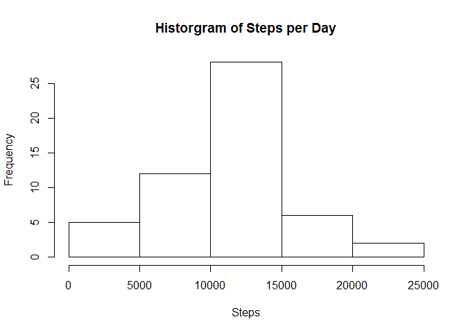
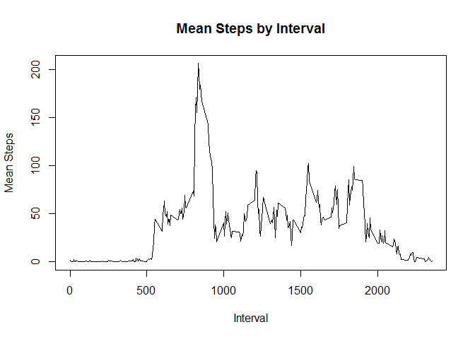
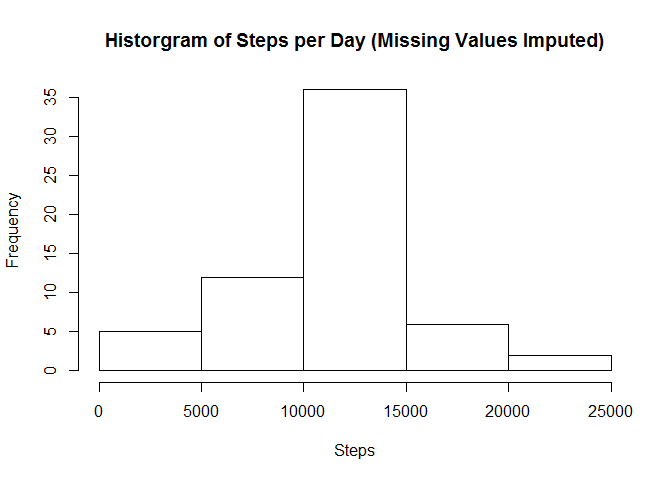
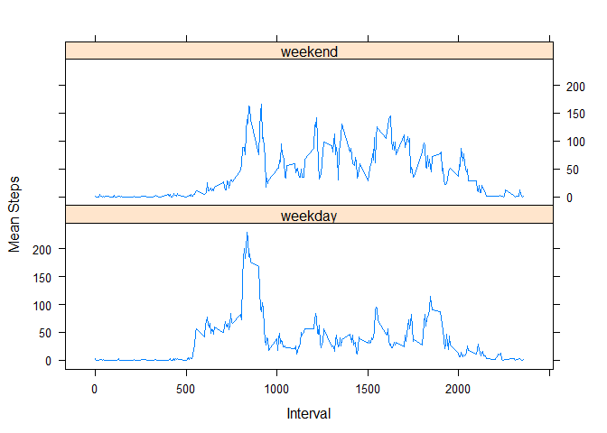

# Reproducible Research Assignment - Adrian Ryan


## Loading and preprocessing the data

The code below loads the data. No preprocessing is required.


```r
data <- read.csv("activity.csv", colClasses = c("integer", "Date", "integer"))
```

## What is mean total number of steps taken per day?

For this part of the assignment, I've ignored the missing values in the dataset.

The code below calculates the total number of steps taken each day.


```r
data.complete <- data[!is.na(data$steps),]

library("plyr")
days <- ddply(data.complete, .(date), summarise, steps = sum(steps))
```

The code below makes a histogram of the total number of steps taken each day.


```r
hist(days$steps, xlab = "Steps", main = "Historgram of Steps per Day")
```

<!-- -->

The code below calculates the mean (to 2 d.p.) and median of the total number of steps taken per day.


```r
steps.mean <- mean(days$steps)
steps.mean <- format(round(steps.mean, 2), nsmall = 2)
steps.median <- median(days$steps)
```
The mean steps per day is 10766.19 and the median is 10765.

## What is the average daily activity pattern?

The code below makes a time series plot of the 5-minute interval (x-axis) and the average number of steps taken, averaged across all days (y-axis)


```r
library("plyr")
intervals <- ddply(data.complete, .(interval), summarise, mean_steps = mean(steps))

plot(intervals, type = "l", main = "Mean Steps by Interval", xlab = "Interval", ylab = "Mean Steps")
```

<!-- -->

The code below calculates which 5-minute interval, on average across all the days in the dataset, contains the maximum number of steps.


```r
max.steps.interval <- intervals[which.max(intervals$mean_steps), "interval"]
```

The answer is interval 835.

## Imputing missing values

There are a number of days/intervals where there are missing values (coded as NA). The presence of missing days may introduce bias into some calculations or summaries of the data.

The code below calculates and reports the total number of missing values in the dataset (i.e. the total number of rows with NAs)


```r
nrow(data[is.na(data$steps),])
```

```
## [1] 2304
```

The strategy I'll use for filling in missing values is to replace the missing value with the mean for the 5-minute interval.

The code below creates a new dataset that is equal to the original dataset but with the missing data filled in.


```r
missing <- data[is.na(data$steps),]

library("sqldf")
data.fixed <- sqldf("SELECT round(i.mean_steps), m.date, m.interval
                       FROM intervals i,
                            missing m
                      WHERE i.interval = m.interval")
colnames(data.fixed) <- c("steps", "date", "interval")

data.new <- rbind(data.complete, data.fixed)
data.new <- data.new[order(data.new$date, data.new$interval),]
```
       
The code below makes a histogram of the total number of steps taken each day and reports the mean and median total number of steps taken per day. 


```r
library("plyr")
days2 <- ddply(data.new, .(date), summarise, steps = sum(steps))
hist(days2$steps, xlab = "Steps", main = "Historgram of Steps per Day (Missing Values Imputed)")
```

<!-- -->

```r
mean(days2$steps)
```

```
## [1] 10765.64
```

```r
median(days2$steps)
```

```
## [1] 10762
```

The mean and median values are very close to those reported earlier.

The shape of the histogram is similar to that produced earlier, but imputing the missing data makes more days available for analysis.

## Are there differences in activity patterns between weekdays and weekends?

I've used the dataset with the filled-in missing values for this part.

The code below makes a panel plot containing a time series plot of the 5-minute interval (x-axis) and the average number of steps taken, averaged across all weekday days or weekend days (y-axis). 


```r
data.new$weekday <- weekdays(data.new$date)
data.new$day.type <- ifelse(data.new$weekday == "Saturday" | data.new$weekday == "Sunday","weekend","weekday")
data.new$day.type <- as.factor(data.new$day.type)

library("plyr")
intervals2 <- ddply(data.new, .(day.type, interval), summarise, mean_steps = mean(steps))

library("lattice")
xyplot(mean_steps~interval|day.type, data = intervals2,
       type='l',layout=c(1,2),
       xlab='Interval',ylab='Mean Steps')
```

<!-- -->
